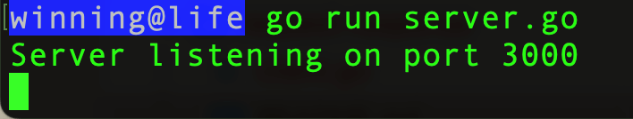
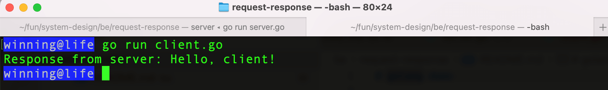
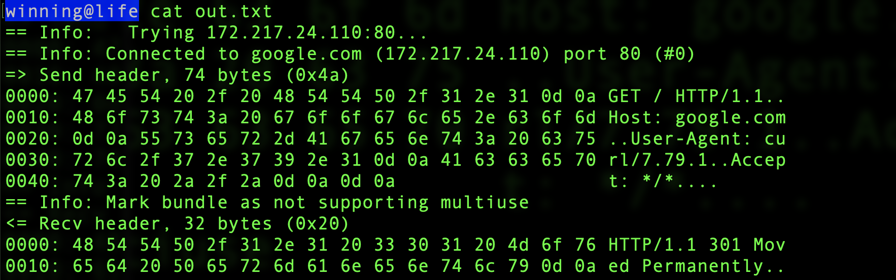

# golang demo of request-response

open terminal

```
$ go run server.go
```



while running server.go, open another terminal

```
$ go run client.go
```



basically server listens to port 3000 and handles request from the /hello endpoint.

client sends request to /hello endpoint, gets a response back from server that says "Hello, client!"

# request response

- client sends a request
  - client defines what the request is
- server parses the request to understand it
  - mostly about parsing where does the request starts and ends
  - cost of parsing is cheap
- server processes the request
  - actually executing the request
  - serialization/deserialization comes here like when youre having a JSON or XML or Protobuf as a payload.
  - there's a cost to deserialization
  - parsing XML is higher than JSON
  - parsing JSON is also slow
  - Protobufs is preferred as it parses quick
- server sends response
- client parses the response and consume

# request-response examples

- http, dns, ssh are request response protocols
  - what if the client sends multiple dns requests? query id. dont rely on order/pipelining when it comes to backend
- RPCs
  - RPCs are popular for the abstraction of remote/local methods
- SQL
  - database protocol
  - send a query, DB parses, processes data for you, sends response back
- API
  - SOAP: rarely used, mostly enterprises
  - GraphQL: idea is basically packaging different requests into 1. Meanwhile in REST is client would have to compose multiple requests. Difference in GraphQL is it moves the responsibility of making multiple requests from the client, to the backend. In GraphQL, client woild have to specify what they need then the server would process everything for it.
  - REST

# anatomy

- it is defined by the protocol, say request structure in GraphQL is defined by both the client and the server.
- a client asking a GraphQL query may look like this

```
query {
  user(id: "123") {
    name
    email
    posts {
      title
      content
    }
  }
}

```

- basically the client specifies to retrieve the name and email of a user with ID "123", as well as the titles and contents of their posts.
- the server then defines the GraphQL schema based on the received query

# more application

go to terminal

```
$ curl -v --trace out.txt http://google.com
```

if you run

```
$ cat out.txt
```

you'll see the ff



basically

- == Info: Trying 172.217.24.110:80...
  - IP address
- => Send header, 74 bytes (0x4a)
  - => means it sent a request
- the ones below it are headers, there's no body in GET requests. POST will have a section for bodies
- <= Recv header, 32 bytes (0x20)
  - <= means a response

# where it's not ideal

- notification services, chat apps, etc.
  - because in request-response, the client has to make a request, then we must design a notification service or chat app where the client keeps requesting for notification or continuously requesting the server for people who are chatting, basically the concept of **polling**.
  - This is not ideal and does not scale, you'll have big latency. You're spamming the network with empty requests.
  - request-response shouldnt be for cases where the client doesnt need to initiate a request, like a notification service you just need the backend to respond for them
    - a common approach for scenarios where backend needs to send notifications to client without prior messaging is to use a communication protocol that supports real-time messaging, such as **WebSockets** or **server-sent events** (SSE).
      - **websocket**: full-duplex bidirectional communication between the client and the server
      - **SSE**: unidirectional unlike websocket. used for scenarios where the server needs to send continuous updates, real-time notifications, or a stream of data to the client
- big requests
  - you'll wait a long time requesting for something big, a different execution like **async processing** would be better
  - what if client disconnects during such a long wait?
